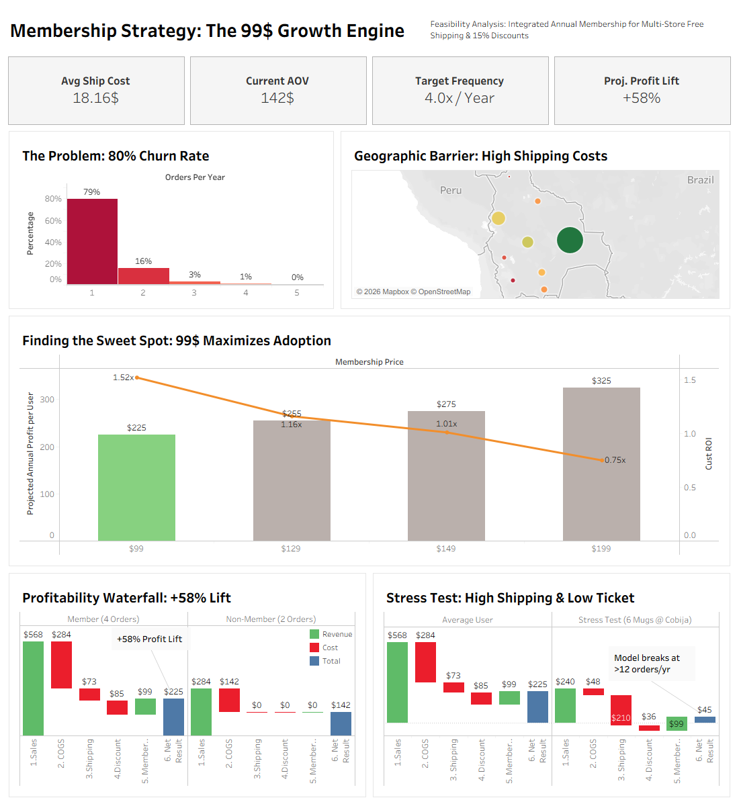

# 🚀 Financial Simulation: Maximizing LTV through a Multi-Brand Membership

### 📊 Strategic Hypothesis (TL;DR)
**Can introducing an Annual Membership Program ($99/year) significantly maximize the Net Profit and Lifetime Value (LTV) across a 4-store e-commerce portfolio?**

This project validates that hypothesis through rigorous financial modeling. Using historical transactional data as a baseline, I modeled pricing elasticity, profit waterfalls, and margin stress-tests. 
**The Conclusion:** The membership model is highly viable, projecting an increase in Annual Customer Net Profit LTV from **$142 to $225 (+58% Net Profit Lift)** per active member, while remaining mathematically robust against worst-case logistics costs.

> 💡 **Interactive Dashboard:** Available in the `tableau/` folder (`membership-multistore.twbx`). *(Tableau Public link pending).*

---

## 🎯 The Commercial Objective
The business currently operates four highly successful, independent apparel brands: *Pasión Albiverde, Rabbona, Victus,* and *Nebula*. While profitable, the current model is highly transactional. 

**The Growth Hypothesis:** By unifying these four distinct audiences under a single **$99 Annual Membership** that offers Free Shipping and cross-store discounts, we can artificially increase Customer Purchase Frequency and Cross-Selling, thereby exponentially increasing Customer LTV and overall Profitability.

## 📉 Establishing the Baseline (Current State)
Before simulating the future, I analyzed 2,919 historical transactions to understand the current "ceiling" of our transactional model:
*   **The LTV Bottleneck:** Currently, **80%** of the user base purchases only once, generating a Baseline Net Profit LTV of only **~$142/year** (per average frequent shopper).
*   **The Siloed Ecosystem:** The Cross-Shop Index is **1.02** (Only 2.16% of users buy from more than one store).
*   **Opportunity Sizing:** These metrics don't represent a broken business, but rather a massive, untapped pool of existing customers ripe for a strategic loyalty play.

## 💡 Validating the Hypothesis (The Financial Simulation)
To prove the viability of the membership, I built a 3-step quantitative simulation acting as a "Proof of Concept" before a real-world launch:

### 1. Pricing Elasticity (Finding the Sweet Spot)
I simulated adoption curves and profit margins across different price tiers ($99, $129, $149). 
*   **Validation:** **$99** is the mathematical sweet spot. It offers a 1.6x ROI for the customer (making it an easy sell) while completely subsidizing the anticipated logistical costs for the business.

### 2. Profitability Waterfall (Member vs. Non-Member LTV)
I built a Unit Economics P&L simulation comparing projected LTVs. 
*   **Validation:** The financial model proves that exchanging "Margin-per-unit" for "Overall Volume + Upfront Fee" is highly lucrative. A Member purchasing 4 times/year generates a Projected Net Profit LTV of **$225**, up from the **$142** baseline. This represents a **+58% Net Profit Lift** per customer compared to a standard transactional user.

### 3. Risk Mitigation (The "Stress Test")
The biggest hypothesis risk was: *Will offering "Free Shipping" bankrupt the company if members abuse it?*
*   **Validation:** Stress-testing the model showed it is virtually bulletproof. A customer would need to place **>12 distinct orders/year** for our lowest-margin items (e.g. 1 coffee mug), shipped to the most expensive remote zones, before the membership operates at a loss. Historically, <0.1% of users exhibit this behavior.

---

## 🛠️ Tools & Technologies
*   **SQL:** Data Extraction & Current-State EDA (Baseline Metrics).
*   **Excel / Python:** Financial logic, Pricing elasticity models, and P&L Waterfall structures.
*   **Tableau:** Executive Dashboard designed to pitch the Strategic Hypothesis to stakeholders.

---

## 📂 Repository Structure & Project Assets
*   `sql/`: Queries for ETL, Identity Resolution, and Churn Segmentation.
*   `data/`: Cleaned CSV datasets powering the analytical models.
*   `tableau/`: The packaged workbook (`.twbx`) containing the interactive narrative.
*   `assets/`: Exported static visualizations for rapid reporting.
*   `doc/EXECUTIVE_REPORT.md`: In-depth business memo detailing the strategic rollout.

